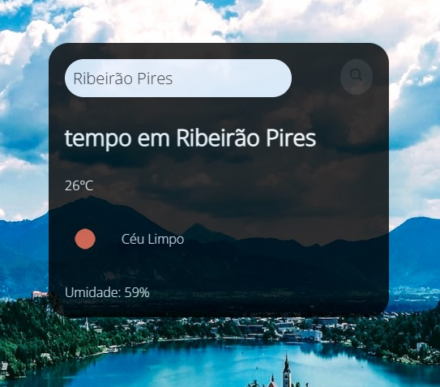

<h1 align="center"> Responsividade </h1>

Projeto exclusivo do Explorer, promovido pela Rocketseat para ensino de tecnologias WEB.  

  <a href="#-tecnologias">Tecnologias</a>&nbsp;&nbsp;&nbsp;|&nbsp;&nbsp;&nbsp;
  <a href="#-projeto">Projeto</a>&nbsp;&nbsp;&nbsp;
 
  

  

 

  

## 🚀 Tecnologias

Esse projeto foi desenvolvido com as seguintes tecnologias:

- HTML e CSS
- Git e Github
- JavaScript

## 💻 Projeto

é um site que mostra  a condição climatica e temperatura das cidades, utilizando uma API para coletar dados em tempo real.

- [Acesse o projeto finalizado, online]( https://marcossantos1990.github.io/app-temp/)

